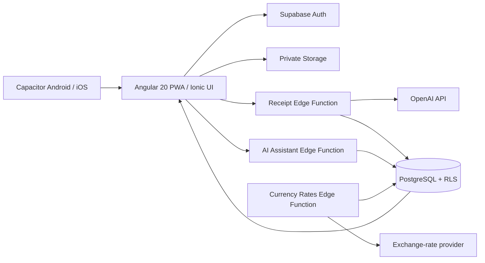

# ExpenseIntel

ExpenseIntel is a full-stack personal-finance progressive web app. It helps people turn receipts into reviewable expense records, understand household spending, and ask data-grounded questions about their finances.

Built as a portfolio project, it demonstrates product-focused frontend development, serverless backend integration, AI-assisted workflows, secure data handling, and automated quality checks.

### The problem

Receipt-based expense tracking is tedious: data must be captured, categorised, corrected, and made useful across different currencies. Generic chat interfaces also risk producing answers that are not backed by a user's actual financial data.

### The solution

ExpenseIntel provides one connected workflow:

1. A signed-in user uploads a JPG, PNG, or PDF receipt to private storage.
2. A server-side function extracts the receipt data using AI and deterministic category and country rules.
3. The user reviews and corrects the extracted data before relying on it.
4. Dashboard and analytics views show trends, category splits, travel spending, and currency-aware totals.
5. The AI assistant responds to questions using the user's scoped finance data.

### Technical highlights

| Capability | Implementation |
| --- | --- |
| Responsive product UI | Angular 20 standalone components, Ionic UI, Angular Material during the remaining page migration, Tailwind CSS v4, desktop sidebar, and mobile bottom navigation |
| Native delivery | Capacitor projects for Android and iOS, including native receipt camera capture and Supabase callback deep links |
| Secure identity and data access | Supabase Auth, protected routes, PostgreSQL Row Level Security, and private receipt storage |
| AI workflow with user control | OpenAI-powered extraction, deterministic fallback rules, and an explicit edit/review step |
| Accurate money handling | Original values retained, configurable reporting currency, live-rate refresh, and country-aware reporting |
| Visual reporting | Apache ECharts for responsive dashboards and analytics |
| Production discipline | Database migrations, Edge Functions, unit tests, production build, and GitHub Actions quality gate |

### Architecture



For implementation detail, see [docs/architecture.md](docs/architecture.md).

## Demo

Sign in instantly without creating an account: open the app and select **Try the Demo Account** on the sign-in screen. It signs you in as an empty account (`demo@homefinance.app`) scoped by Row Level Security, so feel free to upload a receipt and explore freely — nothing you do affects other users' data.

## Features

- Email sign-up, sign-in, password reset, and user preferences.
- Private receipt upload and AI-assisted extraction for images and PDFs.
- Editable receipt history for correcting merchant, amount, date, category, and location data.
- Dashboard totals, time trends, category breakdowns, and filtered analytics.
- Original-currency retention with on-demand conversion to the user's selected reporting currency.
- Spending-by-country analysis for travel expenses.
- An assistant for questions about spending periods, categories, merchants, and trends.

## Technology

| Area | Choice |
| --- | --- |
| Client | Angular 20, TypeScript, Ionic Angular, Tailwind CSS v4, and Angular Material during the remaining page migration |
| Charts | Apache ECharts via `ngx-echarts` |
| Backend | Supabase Auth, PostgreSQL, Storage, and Edge Functions |
| AI | OpenAI APIs for receipt extraction and finance assistant responses |
| Delivery | Angular PWA and Vercel for web; Capacitor for Android and iOS |
| Testing | Jasmine, Karma, Chrome Headless, and GitHub Actions |

## Development Setup 

### Prerequisites

- Node.js 20.19 or later
- npm 10 or later
- A Supabase project
- Supabase CLI for migrations and Edge Function deployment
- An OpenAI API key for receipt processing and assistant features
- Android Studio with the Android SDK for Android builds
- macOS with Xcode for iOS builds

### Quick start

1. Install dependencies.

   ```bash
   npm install
   ```

2. Create local configuration.

   ```bash
   cp .env.example .env.local
   ```

3. Update `.env.local` with your Supabase project values.

   ```text
   SUPABASE_URL=https://your-project-ref.supabase.co
   SUPABASE_ANON_KEY=your Supabase publishable key
   APP_URL=http://localhost:4200
   ```

4. Apply database migrations to your linked development project.

   ```bash
   supabase db push
   ```

5. Configure Edge Function secrets in Supabase, then deploy the functions in `supabase/functions`.

   ```bash
   supabase secrets set OPENAI_API_KEY=your_key
   supabase functions deploy process-receipt
   supabase functions deploy ai-assistant
   supabase functions deploy currency-rates
   ```

6. Start the app and open `http://localhost:4200/`.

   ```bash
   npm start
   ```

### Quality checks

| Command | Purpose |
| --- | --- |
| `npm start` | Run the development server |
| `npm run build` | Generate an optimized production build |
| `npm test` | Run unit tests in watch mode |
| `npm run test:ci` | Run unit tests once in Chrome Headless |
| `npm run verify` | Run the production build and headless test suite |

`npm run verify` is the project quality gate and is executed by [the GitHub Actions workflow](.github/workflows/quality.yml). The current frontend test suite covers application setup, authentication and route guards, Supabase configuration, page components, receipt workflows, and AI assistant success and error states.

### Native mobile builds

The app remains a web PWA and can also be packaged with Capacitor. Both native projects consume the same `dist/expense-intel/browser` build as Vercel.

| Command | Purpose |
| --- | --- |
| `npm run cap:sync` | Build and synchronize both Capacitor platforms |
| `npm run android:sync` | Build and copy the web app into the Android project |
| `npm run android:open` | Open the Android project in Android Studio |
| `npm run ios:sync` | Build and copy the web app into the iOS project |
| `npm run ios:open` | Open the iOS project in Xcode on macOS |

For Android, run `npm run android:sync`, then open the project in Android Studio and run it on an emulator or USB-connected device. For iOS, run `npm run ios:sync` and `npm run ios:open` on a Mac with Xcode, then select an iPhone simulator or device.

Native camera capture uses Capacitor Camera; browser/PWA users keep the regular file picker and browser camera capture. After every frontend change, run the appropriate `*:sync` command before testing a native build.

### Project layout

```text
src/app/
   core/                  Shared auth, Supabase, native media, and deep-link integration
  features/
    auth/                Authentication page
    dashboard/
      pages/             Dashboard, receipt, history, analytics, assistant, settings
      services/          Receipt and assistant client services

supabase/
  functions/             Server-side receipt, assistant, and rate workflows
  migrations/            Versioned database schema and reporting changes

android/                 Capacitor Android application project
ios/                     Capacitor iOS application project
```

## Security and Data Handling

- Browser code uses the Supabase publishable key only. This key is intended for public clients; Row Level Security is the authorization boundary.
- `OPENAI_API_KEY` and `SUPABASE_SERVICE_ROLE_KEY` belong only in Supabase Edge Function secrets, never Angular environment files.
- Receipt files are stored in the private `receipt-images` bucket and should be served with signed URLs.
- Angular route guards improve navigation, but PostgreSQL RLS policies must enforce per-user data isolation.
- AI extraction is treated as a draft: users can review and correct receipt data before using it in reports.

## Deployment

Vercel is configured to build with `npm run build` and serve `dist/expense-intel/browser`, including an SPA rewrite. Its Git integration creates a production deployment when changes are pushed to the configured production branch and preview deployments for pull requests.

### One-time Vercel setup

1. Connect the GitHub repository to the Vercel project and set `main` as the production branch.
2. In Vercel project settings, add the production `SUPABASE_URL`, `SUPABASE_ANON_KEY`, and `APP_URL` environment variables.
3. Set Supabase Auth Site URL to `<APP_URL>` and add `<APP_URL>/auth` to allowed redirect URLs.
4. Add `expenseintel://auth` to Supabase Auth redirect URLs for Android and iOS confirmation and recovery callbacks.
5. Push to `main` to trigger a Vercel production deployment.

GitHub Actions independently runs `npm run verify` for pull requests and pushes to `main`. It reports build and test health, while Vercel remains responsible for deployment.

## Important Implementation Notes

- Reports use receipt date rather than upload date.
- The app preserves `original_total_amount`, `original_currency`, and `exchange_rate` alongside reporting values.
- Exchange rates refresh daily. Current reporting uses the latest stored rate rather than a historical rate at the time of purchase.
- Country detection combines AI extraction with address, merchant, language, and currency clues.
- Database migrations are for schema and shared reference data, not normal user-created receipts or messages.

## Further Reading

- [Architecture guide](docs/architecture.md): boundaries, request flows, security model, and deployment checklist.
- [Environment variable template](.env.example): client configuration values.
- [Database migrations](supabase/migrations): schema and reporting evolution.
- [Edge Functions](supabase/functions): receipt processing, assistant orchestration, and currency-rate refresh.
