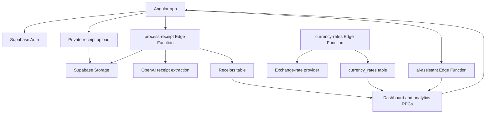

# AI Household Finance Assistant

AI Household Finance Assistant is an Angular and Supabase application for scanning receipts, organizing expenses, analyzing spending, and asking questions about household finance data.

The app is designed as a small fintech-style dashboard with authentication, private receipt storage, OCR-assisted receipt extraction, live currency conversion, category analytics, and an AI assistant that answers questions using the user's own receipt data.

## What The App Does

- Sign up, sign in, reset password, and update account details with Supabase Auth.
- Upload receipt images or PDFs to private Supabase Storage.
- Process receipts with an OpenAI-backed Supabase Edge Function.
- Extract merchant, receipt date, amount, currency, and category.
- Preserve the original receipt amount/currency and convert reports to the user's default currency.
- Track receipt country for travel spending and country-based analytics.
- Refresh exchange rates daily and use the latest stored rates for analytics.
- Browse receipt history and correct OCR mistakes such as merchant, amount, date, and category.
- View dashboard summaries, category breakdowns, monthly trends, and filtered analytics.
- Ask the AI assistant questions about spending, merchants, categories, and trends.

## How It Works



Receipt processing follows this flow:

1. The user uploads a JPG, PNG, or PDF receipt.
2. The file is stored in the private `receipt-images` bucket.
3. The `process-receipt` Edge Function downloads the file.
4. Images are processed through OpenAI vision input; PDFs are processed through OpenAI document input.
5. The function extracts receipt fields and applies deterministic category keyword rules.
6. The function detects receipt country from address, merchant, language, and currency clues.
7. The original receipt amount/currency are preserved.
8. Reported amounts are converted using live rates stored in Supabase.
9. The user can correct OCR mistakes in Receipt History.

## Currency Conversion

Users choose a default currency during signup and can change it later in Settings.

The app stores the original receipt values separately from display/reporting values:

- `original_total_amount`
- `original_currency`
- `exchange_rate`
- `total_amount`
- `currency`

Exchange rates are stored in `currency_rates`. The `currency-rates` Edge Function fetches the latest EUR-based rates from an exchange-rate provider and upserts them into Supabase. A scheduled Supabase cron job refreshes rates daily.

Dashboard, analytics, filtered analytics, and receipt history call database RPCs that convert amounts to the current default currency at query time. This means changing the default currency updates the actual displayed totals, not only the currency symbol.

## Receipt Categories

The app combines AI extraction with deterministic keyword rules. The AI may suggest a category, but the Edge Function also checks merchant keywords for common cases.

Examples:

- `Groceries`: Aldi, Lidl, Rewe, Edeka, Netto, supermarket, grocery
- `Restaurant`: restaurant, cafe, bakery, pizza, burger, Namaste, Crobag, Slurp
- `Transport`: Bahn, DSB, train, metro, taxi, parking, fuel, København H
- `Healthcare`: pharmacy, Apotheke, clinic, doctor, dentist
- `Clothing`: H&M, Zara, Uniqlo, Zalando, Nike, Adidas
- `Travel`: hotel, Airbnb, Booking.com, airline, airport
- `Education`: Hugendubel, bookstore, books, school, university, course
- `Subscriptions`: GitHub, Microsoft, Apple, Google, iCloud, Dropbox, Adobe

Users can correct category mistakes from Receipt History.

## Country Tracking

Receipts store both `country_code` and `country_name` so travel spending can be filtered and summarized independently from currency.

Country detection combines AI extraction with deterministic rules. Examples:

- København, Danmark, or DKK -> Denmark (`DK`)
- Berlin, Deutschland, or GmbH merchant names -> Germany (`DE`)
- Paris or France -> France (`FR`)
- London, UK, or GBP -> United Kingdom (`GB`)

Analytics includes a country filter and a Spending by Country summary. The AI assistant can also answer questions such as "How much did I spend in Denmark?" using the same country filter.

## User Help

The Settings page includes help content for:

- How receipt scanning works.
- How to correct OCR mistakes.
- How currency conversion works.
- How to change the default currency.
- How to update or reset a password.

Receipt History is the main correction workflow. Users can edit merchant, amount, receipt date, and category after scanning.

## Tech Stack

- Angular 20 standalone components
- Angular Material
- Tailwind CSS v4
- Apache ECharts via `ngx-echarts`
- Supabase Auth
- Supabase PostgreSQL
- Supabase Storage
- Supabase Edge Functions
- OpenAI APIs

## Project Structure

```text
src/app/
	core/
		auth/
		supabase/
	features/
		auth/
		dashboard/
			pages/
				analytics/
				assistant/
				dashboard/
				history/
				receipt/
				settings/
			services/

supabase/
	functions/
		ai-assistant/
		currency-rates/
		process-receipt/
	migrations/
```

## Configuration

The Angular app expects Supabase configuration in the environment files:

- `src/environments/environment.ts`
- `src/environments/environment.prod.ts`

Runtime configuration is generated before `start`, `build`, `watch`, and `test` by `scripts/write-env.mjs`.

Create a local `.env.local` file from `.env.example`:

```bash
cp .env.example .env.local
```

Set these values locally and in Vercel project environment variables:

```text
SUPABASE_URL=https://dzrpnyxyxhtvowgcvoco.supabase.co
SUPABASE_ANON_KEY=your Supabase publishable key
APP_URL=https://hussain-home-finance-assistance.vercel.app
```

The generated Angular files are ignored by Git:

```text
src/environments/environment.generated.ts
src/environments/environment.generated.prod.ts
```

Password reset and email confirmation links use `${APP_URL}/auth` in production and `window.location.origin` locally when `LOCAL_APP_URL` is empty.

The Supabase Auth dashboard must also allow the same production callback URL:

```text
https://hussain-home-finance-assistance.vercel.app/auth
```

The Supabase Edge Functions require these secrets:

- `OPENAI_API_KEY`
- `SUPABASE_URL`
- `SUPABASE_ANON_KEY`
- `SUPABASE_SERVICE_ROLE_KEY` for `currency-rates`
- `CURRENCY_REFRESH_SECRET` optional, for protecting manual currency refresh calls

## Database Migrations

Database changes are tracked in `supabase/migrations`.

Use migrations for schema and shared app data, such as:

- receipt columns
- analytics RPCs
- currency rate tables
- scheduled jobs
- seed/reference data

Avoid using migrations for normal user-created runtime data such as individual receipts or chat messages.

## Development

Install dependencies:

```bash
npm install
```

Start the local development server:

```bash
npm start
```

Open `http://localhost:4200/`.

Build the app:

```bash
npm run build
```

Run unit tests:

```bash
npm test
```

## Supabase Edge Functions

The main functions are:

- `process-receipt`: OCR extraction, category detection, currency conversion, and receipt persistence.
- `ai-assistant`: answers user questions using receipt analytics RPCs.
- `currency-rates`: refreshes live exchange rates into the `currency_rates` table.

Deploy functions with the Supabase CLI or the Supabase dashboard tooling used by the project.

## Important Notes

- Receipt analytics use the receipt date, not upload date.
- PDFs are supported for OCR through the `process-receipt` Edge Function.
- Private receipt files are accessed through signed URLs.
- Users should review scanned receipts and correct OCR mistakes when needed.
- Exchange rates are refreshed daily, but historical conversions are based on the latest stored rate unless the reporting RPCs are changed to use historical rate dates.
